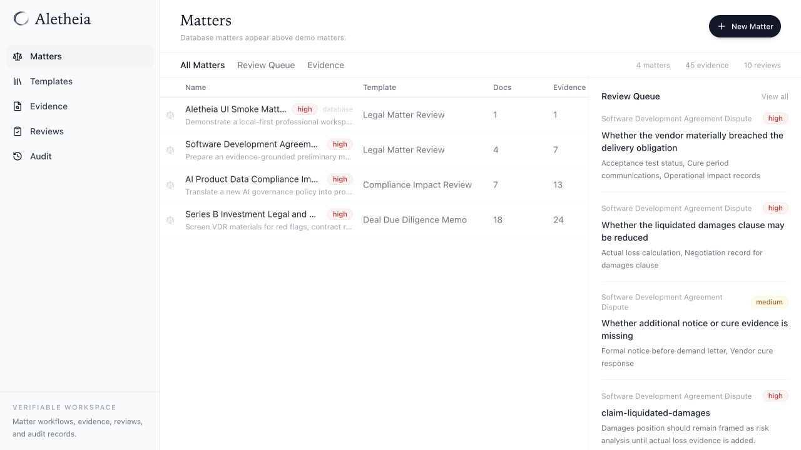
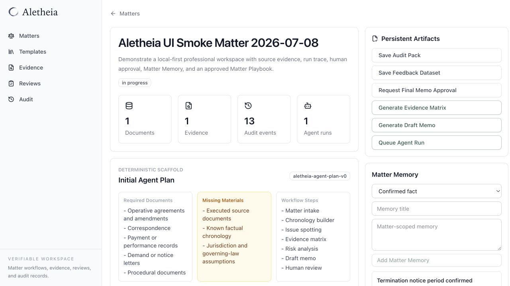
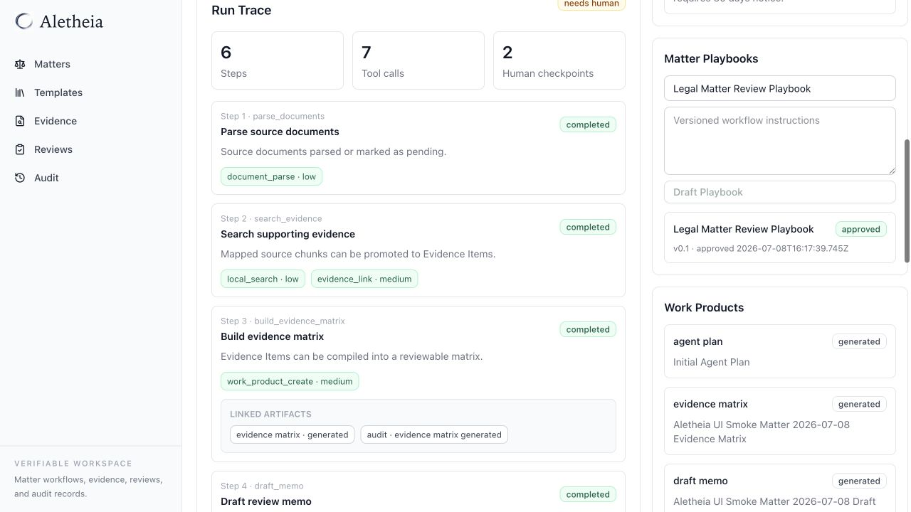
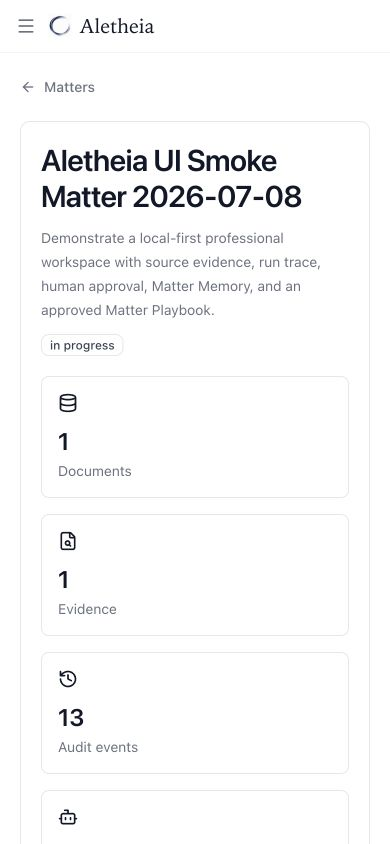

# Aletheia 明证

**Aletheia 明证 is not a legal chatbot.** It is a local-first MVP and private
pilot candidate for a high-stakes professional Agent Workspace: an AgentOps +
Evidence Workspace for expert-led work.

Aletheia turns documents and bounded agent runs into evidence-linked,
reviewed, gated, audited, and eval-ready deliverables. The product is designed
for legal, compliance, audit, due diligence, and regulatory workflows where a
final answer is not enough: reviewers need citations, unsupported-claim flags,
human approvals, gate decisions, audit packs, and feedback loops.

The core product loop is:

```text
Evidence -> Issue/Risk -> Draft -> Review -> Gate -> Audit -> Eval
```

The repository demonstrates a professional agent-system pattern inspired by
Herdr-style multi-agent observability, Tutti-style shared context and handoff,
and Hermes-style skills/memory loops, rebuilt around evidence, expert control,
local-first operation, audit readiness, and eval-driven improvement.

Current stage: **local-first MVP / private pilot candidate**. Aletheia is not
positioned as production-ready legal advice software or as a replacement for
qualified professionals.

## V1 Private Pilot Snapshot

As of 2026-07-09, the V1 private-pilot path is usable for a bounded local
operator demo with explicit caveats. It should be presented as an
expert-support workspace, not production SaaS and not legal advice.

Working local/private-pilot scope:

- Local matters can ingest source documents, preserve document/chunk metadata,
  search matter-scoped source chunks, and map retrieved chunks into
  source-linked evidence.
- The V1 source-index API is available in local mode at
  `GET /aletheia/matters/:matterId/v1/source-index` for documents, chunks, and
  evidence source links.
- The Remote Matter Command Center export path fetches that local source index
  and can include `audit_pack.source_index_manifest` plus source-index manifest
  counts in downloaded local AgentOps export packages.
- Deterministic runtime, gate summaries, review visibility, export/audit
  helpers, and local eval-case fixture helpers are available for focused
  private-pilot validation without external model keys.

Unavailable or partial V1 scope:

- Supabase V1 document/chunk/source listing is unavailable.
- Supabase V1 runtime persistence is unavailable.
- `persistV1RuntimeResult` exists only below the public API boundary; there is
  no public route or approval retry wiring for it.
- Review-derived eval cases are local/helper fixture output until durable
  review-resolution API/status semantics exist; do not describe this as a
  persisted review-to-eval workflow.
- External model calls remain off by default for sensitive/private data and
  must be explicitly configured, logged, and auditable if enabled later.
- Full Playwright UI smoke for the updated V1 route/export flow remains a final
  validation item.

## What A Reviewer Should Notice

- Aletheia makes matter files, source documents, agent traces, work products,
  review decisions, gates, audit events, and eval exports visible in one
  workspace.
- Claims are expected to remain bound to source evidence, support status, and
  human review decisions.
- High-risk exports are blocked until citation and human approval gates pass.
- Expert review feedback becomes structured eval material instead of getting
  lost in comments.
- The demo generalizes beyond legal review into compliance impact assessment,
  audit review, deal due diligence, and regulatory workflows.

## Demo Flow

1. Open `/aletheia`.
2. Open or create a Matter from the Matter Queue.
3. Load the sample Legal Matter Review documents or create a local matter with
   uploaded source files.
4. Show the Matter Command Center: document registry, agent plan, run trace,
   issue map, evidence matrix, work products, review queue, gate state, and
   audit log.
5. Use the Evidence Agent flow to map source chunks into evidence items.
6. Use the Issue/Risk flow to generate the Issue Map and Red Flag Register.
7. Use the Memo flow to draft a Red Flag Memo or legal review memo.
8. Show the Review Agent flagging unsupported or weakly supported claims.
9. Show the Gate Engine blocking final export until citation and human approval
   gates pass.
10. Approve or edit as the expert reviewer.
11. Export the Audit Pack JSON and Feedback Eval Dataset from the workspace.
12. Open the Compliance Impact Review and Deal Due Diligence templates for
    adjacent workflow previews.

See `docs/reviewer_walkthrough.md`, `docs/demo_script.md`,
`docs/feature_map.md`, and `docs/deepseek_pitch.md` for reviewer-facing
walkthrough and positioning material.

## Workflow Templates

- Legal Matter Review: full MVP demo with matter intake, chronology, issue map, evidence matrix, draft memo, human review, audit trail, and feedback summary.
- Compliance Impact Review: local source-linked workflow with obligation/control evidence, issue map, evidence matrix, Compliance Register, human review, and audit trail.
- Deal Due Diligence Memo: local source-linked workflow with VDR evidence, issue map, evidence matrix, Red Flag Memo, diligence questions, human review, and audit trail.

## Architecture

Aletheia adds a structured workspace layer above the existing project, document, model, and storage foundations:

```text
Matter Workspace
  -> Document Registry
  -> Agent Plan
  -> Document Understanding
  -> Evidence Mapping
  -> Domain Analysis
  -> Draft Work Product
  -> Human Review
  -> Audit Log
  -> Feedback / Eval Export
```

Deterministic fallback fixtures are centralized in `frontend/src/aletheia`.
They keep the workspace usable when a local backend is not running, while the
local-first path supports real document upload, parsing, retrieval, evidence
mapping, review, and audited exports. The demo workspace can also export two
local JSON artifacts:

- Audit Pack: matter profile, document registry, workflow artifacts, review log, audit log, and validation status.
- Feedback Eval Dataset: expert review tags mapped back to their target claim, evidence, memo section, and supporting citations.

The first database migration for the workspace domain is
`backend/migrations/20260708_01_aletheia_workspace.sql`. It adds matters,
matter documents, work products, evidence items, review items, and audit events.
`backend/migrations/20260708_02_aletheia_agent_runtime.sql` adds the agent
runtime skeleton: runs, steps, tool calls, and human checkpoints.

The first API surface is mounted at `/aletheia` on the backend and currently
supports listing matters, creating a matter, loading a matter, adding review
items, saving structured work products, appending audit events, uploading and
searching local documents, mapping source-linked evidence, generating evidence
matrices and draft memos, requesting approval checkpoints, maintaining Matter
Memory, drafting and approving Matter Playbooks, and calling the narrow
Aletheia Tool Adapter.
Newly created matters receive a deterministic initial Agent Plan work product so
the workflow starts from a reviewable scaffold even before model integration.

Backend persistence now goes through an Aletheia repository boundary. The
default adapter remains Supabase/Postgres for compatibility with the base
application. The local adapter now supports SQLite persistence for Aletheia
matters, work products, reviews, audit events, and agent runs. Local mode also
stores uploaded documents on disk, extracts text, chunks documents, and indexes
chunks with SQLite FTS5 keyword search.

The Matter Queue now uses a hybrid data model: it renders deterministic
fallback matters immediately, then attempts to load persisted matters from the
Aletheia API. When the backend or auth is not configured, the UI stays usable in
local fallback mode.

## How To Run

```bash
cd frontend
npm install
npm run dev
```

Then open:

```text
http://localhost:3000/aletheia
```

The demo workspace is deterministic and does not require an external model API key.

Run the local-first regression:

```bash
cd backend
npm run test:aletheia:local
```

This uses an isolated temporary data directory and verifies source upload,
local search, evidence mapping, evidence matrix, draft memo, Matter Memory,
Matter Playbooks, run trace, approval gates, local export files, and the stdio
MCP wrapper. The synthetic document fixtures cover TXT, DOCX, and PDF parsing.

Run the restore drill when validating private-deployment readiness:

```bash
cd backend
npm run test:aletheia:restore-drill
```

This creates a real temporary local matter through the regression workflow, then
runs backup manifest, restore preflight, and audit integrity against that same
non-empty data directory.

Run the local retrieval eval:

```bash
cd backend
npm run test:aletheia:retrieval-eval
```

This checks keyword, optional local-json semantic, hybrid retrieval,
fail-closed policy, and matter isolation before retrieval ranking changes.

Run the private preflight before a handoff or local package:

```bash
cd backend
npm run check:aletheia:preflight
```

This runs the backend build, local-first audits, local regression, restore
drill, retrieval eval, package preflight, completion audit, and frontend
lint/build in deployment order. Set `ALETHEIA_PREFLIGHT_INCLUDE_UI=true` to add
the Playwright UI smoke suite.

Run the fast operator health check before a scheduled engineering loop decides
which heavier validations to run:

```bash
cd backend
npm run check:aletheia:operator
```

This checks local privacy defaults, least-privilege tool boundaries,
professional positioning copy, validation entrypoints, and reports the current
worktree size without failing solely because changes are uncommitted.

Run the local deployment doctor before giving an operator a private pilot build:

```bash
cd backend
npm run check:aletheia:doctor
```

This verifies the runtime environment for local/private use: Node 22+,
`node:sqlite`, local storage/auth defaults, writable `.data/aletheia`
directories, retrieval settings, and semantic-index boundaries.

Run the backup manifest check before handoff or migration:

```bash
cd backend
npm run check:aletheia:backup
```

This emits a machine-readable backup scope for `aletheia.db`, `documents/`,
`exports/`, and `index/`, including directory sizes and a SQLite sha256 when a
local database exists.

Run the restore preflight before pointing a new local/private deployment at a
restored data directory:

```bash
cd backend
ALETHEIA_RESTORE_SOURCE_DIR=.data/aletheia npm run check:aletheia:restore
```

This validates the restore source without copying or deleting data. It checks
the local data boundary, required backup directories, symlink-free content,
SQLite `quick_check`, core Aletheia tables, and an optional backup manifest.

Run the privacy preflight before committing, handoff, or packaging:

```bash
cd backend
npm run check:aletheia:privacy
```

This scans tracked repository files for accidental `.data` artifacts,
disallowed `.env` files, high-confidence secret patterns, and non-placeholder
private deployment tokens without reading untracked client documents.

Run the operational readiness audit before private deployment or packaging:

```bash
cd backend
npm run check:aletheia:ops-readiness
```

This verifies the local doctor, local launcher, `/health` endpoint, private
token auth boundary, package manifest, backup/restore/audit integrity chain,
and private deployment runbook coverage.

Run the source provenance audit before changing document parsing, evidence
mapping, or work product generation:

```bash
cd backend
npm run check:aletheia:source-provenance
```

This verifies that source-linked evidence keeps document IDs, source chunk IDs,
quotes, quote offsets, support status, FTS5 matter filters, UI registry fields,
and exportable provenance.

Run the knowledge governance audit before changing Matter Memory or Playbooks:

```bash
cd backend
npm run check:aletheia:knowledge-governance
```

This verifies matter-scoped memory, human-approved playbooks, draft-only
improvement proposals, no global legal memory, and no default Tool Adapter
mutation path for knowledge artifacts.

Run the Audit Workbench audit before changing registry pages, export packets,
or local audit review UI:

```bash
cd backend
npm run check:aletheia:audit-workbench
```

This verifies Evidence, Reviews, and Audit registry filters, filtered JSON
exports, matter-scoped `registry_snapshot` saves, UI smoke coverage, and local
snapshot audit events.

Run the Tool Adapter policy audit before enabling agent integrations:

```bash
cd backend
npm run check:aletheia:tool-policy
```

This verifies that the HTTP Tool Adapter and stdio MCP wrapper expose only the
approved narrow allowlist, keep browser/terminal/web/email/destructive tools
disabled, and preserve approval-gate policy signals.

Run the approval policy audit before private handoff:

```bash
cd backend
npm run check:aletheia:approval-policy
```

This verifies that high-risk exports require approved human checkpoints,
playbook updates stay human-approved, external-source use remains controlled,
and regression/audit checks still cover those gates.

Run the matter isolation audit before changing retrieval or memory behavior:

```bash
cd backend
npm run check:aletheia:matter-isolation
```

This verifies matter/user-scoped repository access, SQLite FTS5 matter filters,
per-matter semantic index files, matter-scoped memory/playbooks, cross-matter
retrieval eval coverage, and documentation against cross-matter contamination.

Run the Run Trace audit before changing agent runtime or review UI behavior:

```bash
cd backend
npm run check:aletheia:run-trace
```

This verifies the AgentRun/AgentStep/ToolCall/HumanCheckpoint contract,
Workflow Graph controls, specialist role tool allowlists, approval gates,
resume behavior, and Run Trace UI/docs coverage.

Generate the release evidence manifest before handoff:

```bash
cd backend
ALETHEIA_RELEASE_EVIDENCE_OUT=../release-evidence.json npm run check:aletheia:evidence
```

This emits a reviewable JSON manifest for the current git commit, validation
commands, demo screenshots with hashes, deployment/attribution documents,
privacy defaults, and approval posture.

Run the audit integrity check after a real local matter workflow or before
handoff:

```bash
cd backend
ALETHEIA_AUDIT_SOURCE_DIR=.data/aletheia npm run check:aletheia:audit-integrity
```

This validates the local audit chain without mutating data: export work products
must have matching audit events, export files must exist under the local data
directory, high-risk exports must resolve to approved human checkpoints, and
local export files are reported with byte counts and sha256 hashes.

The same validation posture is enforced on `main` and pull requests through
`.github/workflows/aletheia-local-ci.yml`. The CI workflow installs backend and
frontend dependencies, builds both apps, runs the local regression, restore
drill, and retrieval eval, executes privacy, tool-policy, approval-policy,
matter-isolation, package, evidence, integrity, and completion checks, then runs
frontend lint and the Aletheia UI smoke suite.

Create a screenshot-ready local UI smoke matter:

```bash
cd backend
npm run seed:aletheia:ui-smoke
```

See `docs/ui_smoke.md` for the full browser verification flow.
Run the automated UI smoke:

```bash
cd frontend
npm run test:aletheia:ui
```

The smoke runs against isolated local backend/frontend services and covers both
desktop Chromium and a mobile Chromium viewport, including screenshot baseline
assertions for the initial workspace render.

See `docs/private_deployment.md` for local desktop and private single-tenant
deployment notes.
See `docs/hybrid_retrieval.md`, `docs/retrieval_eval.md`, and
`docs/desktop_packaging_checklist.md` for retrieval, eval, and packaging
follow-up plans.
See `docs/release_notes_local_first_mvp.md` for the current local-first MVP
summary.
See `docs/status.md` for the current release-readiness snapshot and blockers.

Start local backend and frontend together:

```bash
cd backend
npm run dev:aletheia:local
```

The launcher leaves existing dev servers untouched and prints the MCP command
for clients that should start the stdio wrapper.

## Local Pilot Mode

Current MVP uses deterministic fallback data for stable offline and screenshot
behavior:

- `frontend/src/aletheia/mockData.ts`
- `frontend/src/aletheia/workflow.ts`
- `frontend/src/aletheia/schemas.ts`
- `frontend/src/aletheia/exports.ts`

The local-first path now supports source document upload, text extraction,
SQLite FTS5 search, mapping retrieved chunks into persisted Evidence Items, and
generating source-linked Issue Map, Evidence Matrix, and Draft Memo work
products. Local search results include deterministic claim/issue suggestions so
source chunks can be mapped without manually typing a claim ID, while still
remaining reviewable and overrideable. Search results now expose rank, score
direction, retrieval layers, and a plain-language ranking basis so evidence
selection is auditable. The workspace renders Issue Map groups with support
counts, open questions, source documents, and representative quotes for expert
review, and reviewers can tag mapped claims directly from the Issue Map panel
with saved review tags echoed back on the mapped issue. Agent runs now expose a
reviewable trace with bounded specialist role labels, allowed tool lists, steps,
tool calls, human checkpoints, and persisted Workflow Graph metadata. Audit
Pack, Feedback Dataset, and Final Memo exports
are blocked by executable human approval gates. Run Trace entries now surface
linked work products, audit events, and directed graph transitions. Matter
Memory and Matter Playbooks are now matter-scoped, persisted locally, and
audited; playbooks must be explicitly approved before use as a professional
workflow manual. Reviewer feedback and review tags can generate draft Playbook
Improvement Proposals without mutating approved playbooks. The Aletheia Tool
Adapter now exposes a narrow least-privilege tool surface for
external agents without enabling terminal, browser, web search, email, or
destructive file operations. Export-class work products are also written to the
local export store under `.data/aletheia/exports`. The Audit page now works as
a live local Audit Workbench: it aggregates persisted matter audit events,
review tags, work products, approval gates, and matter readiness packets instead
of relying only on demo data. Evidence and Reviews pages also read persisted
local matters, so source-backed evidence and human review tags can be inspected
across the workspace. Evidence, Reviews, and Audit views include local filters
for matter, claim, support status, review tag, and audit action to make audit
material easy to locate during expert review, and each view can export the
filtered result set as local JSON for a review packet or demo evidence. The same
filtered views can also be saved back into each affected matter as
`registry_snapshot` work products, persisted under the local export store with
an audit event and matter-scoped provenance.

## Screenshots

Matter Queue:



Local Matter Workspace:



Agent Run Trace:



Mobile Workspace:



## License And Attribution

This repository retains the original open-source license file and attribution notes. See `docs/license_attribution.md`.

## Roadmap

1. Replace or augment the local-json semantic prototype with a LanceDB-backed
   local semantic index adapter behind `ALETHEIA_SEMANTIC_INDEX_ENABLED=true`.
2. Harden the private desktop packaging prototype into a signed installer or
   operator-managed bundle.
3. Split inherited oversized frontend/backend files before major feature work.
