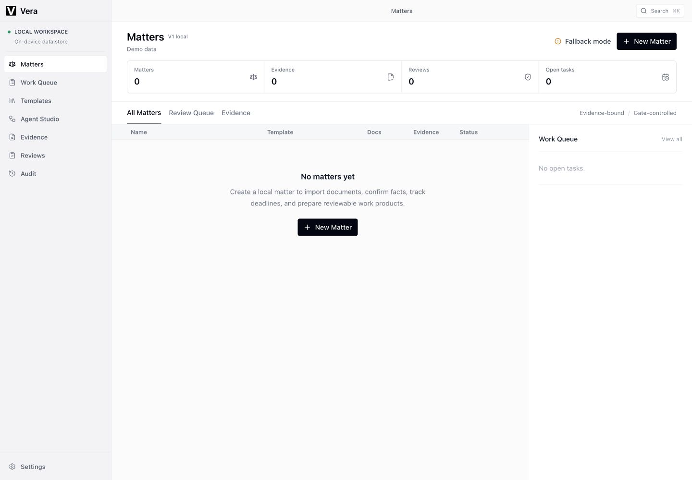
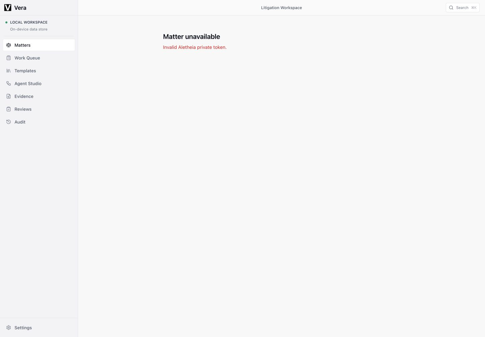

# Vera Product Convergence Audit

**Date:** 2026-07-12

**Product:** `http://127.0.0.1:43760`

**Audience:** Chinese civil/commercial litigation lawyer

**Method:** Read-only live-product inspection at 1440x1000 and 393x1200, plus the repository's isolated single-user Playwright fixture/auth harness for blocked litigation sections. No application code or live matter data was changed.

## Readiness Verdict

**FAIL - not ready for product convergence.**

The restrained shell and several useful litigation primitives are present, but they do not form one trustworthy daily workflow. The live product presents four incompatible states at once:

1. The live Matters list contains `0` matters.
2. Evidence, Reviews, and Audit expose English demo records for a legacy software-contract dispute.
3. Agent Studio opens a different `Vendor Security Breach Review` fixture.
4. The civil-litigation route is a dead end: `Matter unavailable - Invalid Aletheia private token.`

This is a structural convergence failure, not a polish problem. A lawyer cannot tell which matter is real, which state is authoritative, or where to continue work.

## Audit Scope And Blocker

The live flow covered the home, Matters, New Matter, the legacy demo matter overview, litigation route, Work Queue, Evidence, Reviews, Audit, Settings, and Agent Studio. The civil-litigation workbench's primary sections were not reachable on `43760` because desktop private-token authentication failed. The existing isolated Playwright harness confirmed the intended Claims & Defenses and Documents & Hearing structures; those fixture captures are supporting evidence, not proof that the live route works.

Screenshot-only accessibility findings are risks, not a WCAG compliance determination. Keyboard order, screen-reader announcements, contrast ratios, zoom behavior, and error recovery still require implementation-level testing.

## Prioritized Findings

### P0 - One Matter Does Not Have One Route Or One Source Of Truth

The product has competing matter identities and data planes. The Matters screen reports no matters, while global Evidence has 7 records, Reviews has 5 items, and Audit has 1 matter with 6 events. The legacy matter is `Software Development Agreement Dispute`; Agent Studio is `Vendor Security Breach Review`; the fixture-auth workbench uses a separate civil-litigation matter. These surfaces cannot be reconciled by the user.

Evidence: [02](screenshots/product-convergence-audit-2026-07-12/02-desktop-matters-empty-1440x1000.png), [04](screenshots/product-convergence-audit-2026-07-12/04-desktop-demo-matter-overview-1440x1000.png), [07](screenshots/product-convergence-audit-2026-07-12/07-desktop-reviews-demo-1440x1000.png), [08](screenshots/product-convergence-audit-2026-07-12/08-desktop-audit-demo-1280x720.png), [10](screenshots/product-convergence-audit-2026-07-12/10-desktop-evidence-demo-1280x720.png), [17](screenshots/product-convergence-audit-2026-07-12/17-desktop-agent-studio-fixture-1440x1000.png).

**Required convergence:** one canonical matter record and router. Every list, evidence item, review, task, audit event, agent action, and document must deep-link into the same matter workbench and preserve the selected object.

### P0 - The Primary Litigation Journey Is A Dead End

The visible civil-litigation route fails with an internal authentication message and offers no recovery action, no return link, and no explanation in lawyer-facing language. Work Queue and Settings expose the same token failure while also rendering empty or disabled content. This makes an infrastructure fault look like valid zero-state data.

Evidence: [05](screenshots/product-convergence-audit-2026-07-12/05-desktop-litigation-unavailable-1440x1000.png), [06](screenshots/product-convergence-audit-2026-07-12/06-desktop-work-queue-error-empty-1440x1000.png), [09](screenshots/product-convergence-audit-2026-07-12/09-desktop-settings-offline-1280x720.png), [14](screenshots/product-convergence-audit-2026-07-12/14-narrow-litigation-unavailable-393x1200.png).

**Required convergence:** fail once at shell level with a truthful local-service state. Do not render empty matter/task states or demo fallbacks when authorization has failed.

### P0 - Demo Fallbacks Compete With The Product

`Demo data`, `Fallback mode`, `Deterministic fallback`, `workflow v0`, `Fixture demo`, `aletheia-demo-v0`, and demo timestamps are visible throughout core work. The fallback registries remain interactive and link to the legacy matter, creating a plausible but disconnected workflow. This is more dangerous than a clear unavailable state because a lawyer may treat fixture records as matter data.

Evidence: [02](screenshots/product-convergence-audit-2026-07-12/02-desktop-matters-empty-1440x1000.png), [04](screenshots/product-convergence-audit-2026-07-12/04-desktop-demo-matter-overview-1440x1000.png), [07](screenshots/product-convergence-audit-2026-07-12/07-desktop-reviews-demo-1440x1000.png), [08](screenshots/product-convergence-audit-2026-07-12/08-desktop-audit-demo-1280x720.png), [10](screenshots/product-convergence-audit-2026-07-12/10-desktop-evidence-demo-1280x720.png), [17](screenshots/product-convergence-audit-2026-07-12/17-desktop-agent-studio-fixture-1440x1000.png).

**Required convergence:** remove runtime demo fallback records from the installed product path. Keep fixtures in tests or an explicitly entered demo mode that cannot be confused with local matter data.

### P1 - Navigation Duplicates Objects Instead Of Preserving Context

Global Matters, Work Queue, Templates, Agent Studio, Evidence, Reviews, and Audit compete with matter-local workflow concepts. The legacy matter's `Command Center` leaves the matter and opens unrelated Agent Studio fixture data. Global Evidence and Reviews rows return to the legacy all-in-one overview rather than the corresponding evidence or review inside a civil-litigation workbench. `Agent Studio`, `Command Center`, and fixture `Agent Run` are three entrances to overlapping agent concepts.

Evidence: [04](screenshots/product-convergence-audit-2026-07-12/04-desktop-demo-matter-overview-1440x1000.png), [07](screenshots/product-convergence-audit-2026-07-12/07-desktop-reviews-demo-1440x1000.png), [10](screenshots/product-convergence-audit-2026-07-12/10-desktop-evidence-demo-1280x720.png), [17](screenshots/product-convergence-audit-2026-07-12/17-desktop-agent-studio-fixture-1440x1000.png), [18](screenshots/product-convergence-audit-2026-07-12/18-fixture-claims-review-1280x720.png), [19](screenshots/product-convergence-audit-2026-07-12/19-fixture-documents-hearing-1280x720.png).

**Required convergence:** global queues should be cross-matter indexes only. Selecting an item must open the exact object in its canonical matter workbench. Agent execution should be a contextual matter action, not a parallel workspace.

### P1 - The Next Action Is Weak Or Misleading

The installed app opens on a promotional English home instead of the daily workspace. The empty Matters screen repeats `New Matter` twice. The legacy matter promotes `Export Audit Pack` despite `final export blocked`, and promotes `Command Center` even though it opens unrelated data. The matter overview's first viewport distributes attention across profile, document cards, agent plan, issue map, evidence matrix, and an evidence review panel without identifying the single next required lawyer action.

Evidence: [01](screenshots/product-convergence-audit-2026-07-12/01-desktop-home-1440x1000.png), [02](screenshots/product-convergence-audit-2026-07-12/02-desktop-matters-empty-1440x1000.png), [04](screenshots/product-convergence-audit-2026-07-12/04-desktop-demo-matter-overview-1440x1000.png), [13](screenshots/product-convergence-audit-2026-07-12/13-narrow-demo-matter-overview-393x1200.png).

**Required convergence:** open the installed product on Matters. Within a matter, show one primary `Continue` action derived from state: complete intake, import missing material, confirm evidence, resolve a review, confirm a deadline, or prepare a document.

### P1 - Generic English Intake Does Not Establish A Chinese Litigation Matter

New Matter asks only for Title, Template, Objective, Workspace, and Risk. It does not establish the basic civil/commercial litigation frame visible to counsel: parties and roles, court/jurisdiction, cause of action, case number/status, representation side, service or filing anchors, claim amount/currency, and limitation/deadline assumptions. `Civil Litigation` is selected, but the remaining form and all helper copy are generic English.

Evidence: [03](screenshots/product-convergence-audit-2026-07-12/03-desktop-new-matter-1440x1000.png), [12](screenshots/product-convergence-audit-2026-07-12/12-narrow-new-matter-393x1200.png).

**Required convergence:** keep creation short, then route directly into a civil-litigation intake checklist in the matter workbench. Do not expand the modal into a second workbench.

### P1 - Narrow Layout Hides Navigation And Record Meaning

At 393 px, the primary navigation is a horizontally clipped strip with `Agent Studio` cut off and Evidence, Reviews, Audit, and Settings outside the visible viewport. There is no clear overflow affordance. Evidence and Reviews retain desktop table geometry: the second column begins near the right edge, text is clipped, support/risk states disappear, and rows cannot be understood as complete records. This is an occlusion and responsive-reflow failure, not merely dense layout.

Evidence: [11](screenshots/product-convergence-audit-2026-07-12/11-narrow-matters-empty-393x1200.png), [14](screenshots/product-convergence-audit-2026-07-12/14-narrow-litigation-unavailable-393x1200.png), [15](screenshots/product-convergence-audit-2026-07-12/15-narrow-evidence-demo-393x1200.png), [16](screenshots/product-convergence-audit-2026-07-12/16-narrow-reviews-demo-393x1200.png).

**Accessibility risk:** clipped navigation and missing row states can prevent keyboard, low-vision, and touch users from discovering destinations or understanding evidence status. Verify focus order and names after reflow is fixed.

### P2 - The Workbench Has Useful Controls But Excessive Simultaneous Density

The fixture-auth harness confirms useful legal controls: source support, original-scan comparison, authority readiness, review requests/resolution, stale-artifact blocking, document generation, and hearing preparation. However, the claims screen places evidence state, authority state, review state, proposal creation, review request, and review resolution in one dense view. Documents & Hearing combines draft register, document editor, evidence catalog, claim matrix, artifact versions, approval/export state, and hearing work. The primitives are worth retaining, but the modes need a shared hierarchy and progressive disclosure.

Evidence: [18](screenshots/product-convergence-audit-2026-07-12/18-fixture-claims-review-1280x720.png), [19](screenshots/product-convergence-audit-2026-07-12/19-fixture-documents-hearing-1280x720.png).

## Retain / Merge / Remove / Defer

| Decision | Surface or capability | Convergence action |
|---|---|---|
| **Retain** | Quiet macOS/Codex-like shell, compact typography, restrained borders and status colors | Use as the visual baseline; do not add decorative dashboards or marketing surfaces. |
| **Retain** | Matters as the default object, New Matter modal pattern, Work Queue concept | Connect all three to one canonical civil-litigation matter model. |
| **Retain** | Source-linked facts/evidence, claims/defenses, authority readiness, procedural deadlines, stale-artifact gates, review resolution, audit history | Make these matter-local sections with cross-matter indexes as secondary access. |
| **Retain** | Documents & Hearing generation and stale-state blocking | Keep as the production/output section after facts, claims, and procedure are ready. |
| **Merge** | Matter overview, intake, document import, missing-materials list | One `Overview & Intake` section with matter identity, completeness, imports, and next action. |
| **Merge** | Legacy Evidence Matrix, global Evidence Registry, fixture Facts & Evidence | One matter-local `Facts & Evidence` model; global Evidence becomes a filtered index and deep link. |
| **Merge** | Issue Map, Claims & Defenses, position review, legal authorities | One `Claims & Authorities` section with review state and source support. |
| **Merge** | Procedural events, deadline rules, court calendars, Work Queue | One `Procedure & Tasks` section; confirmed deadlines project into the global queue. |
| **Merge** | Human Review, export gates, Audit Workbench, audit pack | One `Review & Audit` section with pending decisions first and immutable history second. |
| **Merge** | Agent Studio, Command Center, Agent Run | A contextual matter command/action with run status; remove the separate fixture workspace from primary navigation. |
| **Remove** | Promotional home and GitHub CTA from the installed daily-work path | Route `/aletheia` to `/aletheia/matters`. |
| **Remove** | Runtime demo/fallback records and labels from normal product routes | Keep in tests or explicit demo mode only. |
| **Remove** | Duplicate `New Matter` CTA on the same empty screen | Keep one primary action. |
| **Remove** | Internal copy such as `V1 local`, `workflow v0`, `Fixture demo`, `aletheia-demo-v0`, `badcase`, and `Invalid Aletheia private token` | Replace with user-facing state only where the state is actionable. |
| **Defer** | Eval Lab, candidate skills, diagnostic metrics, filtered JSON exports, snapshot controls | Reintroduce after canonical routing, matter state, and daily litigation flow are stable. |
| **Defer** | Broad template marketplace/navigation | Keep Civil Litigation creation; move template administration out of the primary daily path. |

## Proposed Unified Matter-Workbench IA

### Global Shell

1. **Matters** - default landing; recent/active matters and one New Matter action.
2. **Work Queue** - cross-matter deadlines, reviews, missing materials, and assigned tasks.
3. **Search** - cross-matter search that opens the exact source object in context.
4. **Settings** - local runtime, models, safety, backup, and integrations.

Evidence, Reviews, and Audit remain available as filtered views from Work Queue/Search, but do not compete as primary destinations. Templates and agent administration are secondary settings/tools.

### Matter Workbench

1. **Overview & Intake** - parties, roles, court, cause, case/status, objective, claim amount, risk, document completeness, imports, next required action.
2. **Facts & Evidence** - source documents, import/parse state, chronology, confirmed facts, evidence support/contradiction, original inspection.
3. **Claims & Authorities** - claims, defenses, burden/elements, positions, legal authorities, source sufficiency, open decisions.
4. **Procedure & Tasks** - procedural events, service/filing anchors, rule calculations, court calendar, confirmed deadlines, task projection.
5. **Documents & Hearing** - pleadings, evidence catalog, matrices, briefs, hearing bundle/checklist, versioning, approval/export readiness.
6. **Review & Audit** - pending human decisions, gate blockers, review history, audit trail, signed/exported packages.

The matter header should persist matter identity and expose one state-derived primary action. Agent execution is invoked inside the relevant section and remains bound to the matter, inputs, and review gate.

## Smallest First Implementation Slice

**Goal:** make one civil-litigation matter travel from Matters to a trustworthy workbench without touching visual decoration.

1. Establish one canonical `civil_litigation` matter route: `/aletheia/matters/:matterId/litigation?view=overview`.
2. Remove the special legacy demo-matter branch and runtime fallback registries from normal routes. When the local service is unauthorized/unavailable, show one shell-level blocking state and no fixture rows.
3. Route every matter row and global task/evidence/review/audit item through the canonical matter ID and exact workbench view/object ID.
4. Redirect `/aletheia` to `/aletheia/matters`; remove the installed-product marketing home from the daily path.
5. Make `Overview & Intake` the first workbench view. It needs only matter identity, document import/completeness, pending decisions/deadlines summary, and one state-derived `Continue` action for this slice.
6. Collapse the narrow primary navigation to Matters, Work Queue, Search, and an overflow menu; reflow evidence/review rows into stacked records rather than clipped desktop tables.

**Acceptance test for the slice:** create or open one civil-litigation matter, import a document, enter Facts & Evidence, open a linked claim/review, confirm a procedural deadline in Work Queue, and return to the same matter without encountering demo data, a different matter identity, a duplicate command center, or an internal auth message.

## Screenshot Manifest

Live `43760` evidence:

- `docs/screenshots/product-convergence-audit-2026-07-12/01-desktop-home-1440x1000.png`
- `docs/screenshots/product-convergence-audit-2026-07-12/02-desktop-matters-empty-1440x1000.png`
- `docs/screenshots/product-convergence-audit-2026-07-12/03-desktop-new-matter-1440x1000.png`
- `docs/screenshots/product-convergence-audit-2026-07-12/04-desktop-demo-matter-overview-1440x1000.png`
- `docs/screenshots/product-convergence-audit-2026-07-12/05-desktop-litigation-unavailable-1440x1000.png`
- `docs/screenshots/product-convergence-audit-2026-07-12/06-desktop-work-queue-error-empty-1440x1000.png`
- `docs/screenshots/product-convergence-audit-2026-07-12/07-desktop-reviews-demo-1440x1000.png`
- `docs/screenshots/product-convergence-audit-2026-07-12/08-desktop-audit-demo-1280x720.png`
- `docs/screenshots/product-convergence-audit-2026-07-12/09-desktop-settings-offline-1280x720.png`
- `docs/screenshots/product-convergence-audit-2026-07-12/10-desktop-evidence-demo-1280x720.png`
- `docs/screenshots/product-convergence-audit-2026-07-12/11-narrow-matters-empty-393x1200.png`
- `docs/screenshots/product-convergence-audit-2026-07-12/12-narrow-new-matter-393x1200.png`
- `docs/screenshots/product-convergence-audit-2026-07-12/13-narrow-demo-matter-overview-393x1200.png`
- `docs/screenshots/product-convergence-audit-2026-07-12/14-narrow-litigation-unavailable-393x1200.png`
- `docs/screenshots/product-convergence-audit-2026-07-12/15-narrow-evidence-demo-393x1200.png`
- `docs/screenshots/product-convergence-audit-2026-07-12/16-narrow-reviews-demo-393x1200.png`
- `docs/screenshots/product-convergence-audit-2026-07-12/17-desktop-agent-studio-fixture-1440x1000.png`

Isolated fixture/auth harness evidence:

- `docs/screenshots/product-convergence-audit-2026-07-12/18-fixture-claims-review-1280x720.png`
- `docs/screenshots/product-convergence-audit-2026-07-12/19-fixture-documents-hearing-1280x720.png`

## Flow Health Summary

1. **Home to Matters - Poor:** promotional English entry adds a non-work step.
2. **Matters list - Failed:** truthful list is empty while other surfaces show fixture matter data.
3. **New Matter - Partial:** usable modal, but generic English intake and duplicate entry action.
4. **Matter overview/import - Poor:** legacy all-in-one demo is dense and has no coherent path to civil-litigation intake/import.
5. **Litigation workspace - Failed live / partial in fixture:** private-token dead end live; useful section primitives exist in the harness.
6. **Evidence and claims - Poor:** source-linked concepts exist, but global records, legacy matter, and fixture workbench are disconnected; narrow records are clipped.
7. **Procedure and Work Queue - Failed live:** auth error is rendered with an empty queue, and no matter-local route is reachable.
8. **Documents and hearing - Partial in fixture:** useful stale/version/generation controls, but not reachable from the live matter journey.
9. **Reviews and Audit - Poor:** demo records are visible and interactive but disagree with live matter counts and routing.
10. **Settings - Poor:** offline cache is visible, most controls are disabled, and the internal token error has no recovery path.
