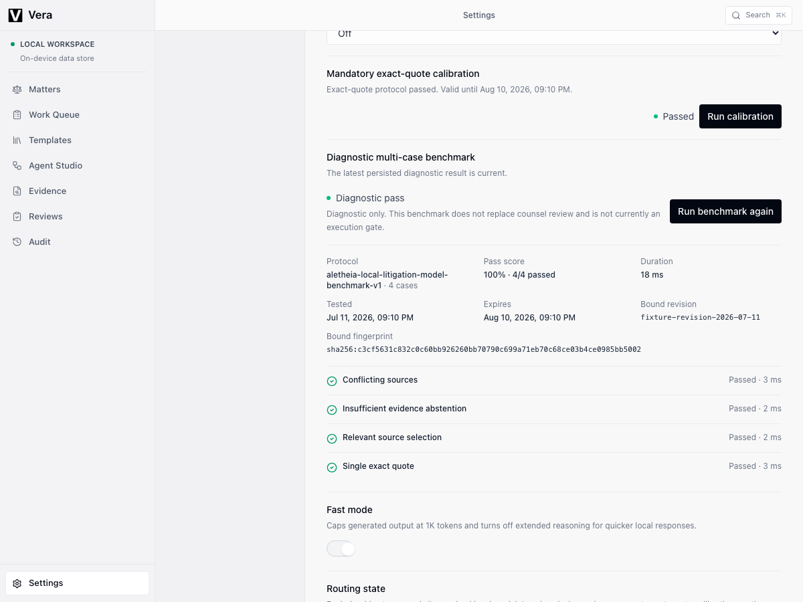
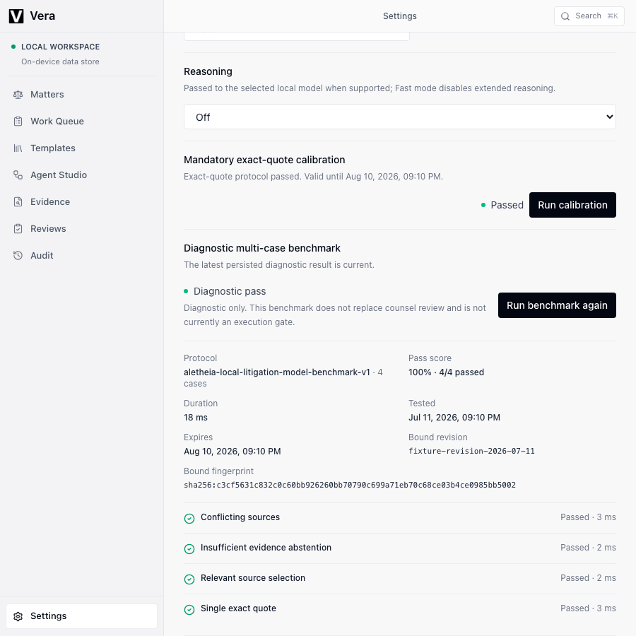
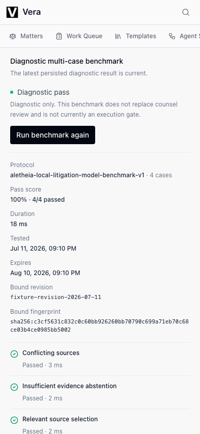

# Local model benchmark UI audit

Date: 2026-07-11
Visual lead: Sol
Surface: Settings > Models

## Sol verdict

**Approved.** The persisted diagnostic benchmark is visually clear and operational at desktop, narrow, and mobile widths. It remains distinct from mandatory exact-quote calibration, states that it does not replace counsel review, and states that it is not currently an execution gate.

The surface uses the existing restrained settings list. There are no nested cards, gradients, glows, glass treatments, decorative pills, fake progress, or marketing copy. The action remains single-line, metadata reflows from three to two to one column, case results stay aligned, and the immutable fingerprint wraps without clipping.

## Measurements

| Capture | Viewport | Document scroll width | Horizontal overflow | Settings header bounds |
| --- | ---: | ---: | ---: | --- |
| `desktop-1200.png` | 1200 px | 1200 px | 0 px | left 232, right 1200, width 968, height 77 |
| `narrow-900.png` | 900 px | 900 px | 0 px | left 232, right 900, width 668, height 77 |
| `mobile-393.png` | 393 px | 393 px | 0 px | left 0, right 393, width 393, height 77 |

No benchmark control, status, metadata value, case label, duration, revision, or fingerprint overlaps another element in the inspected captures.

## Evidence

## Verification method

Playwright starts a deterministic loopback OpenAI-compatible runtime while the application backend runs normally. The test calls the real backend model start, calibration, benchmark, and list routes. It verifies:

- benchmark is enabled only for a ready model with accepted current calibration;
- a four-case passing result is persisted and survives browser refresh;
- `GET /local-models` returns the persisted cases and accepted diagnostic projection;
- a deliberately failed semantic case is persisted and shown with concise failure detail;
- changing reasoning settings makes the persisted result stale and disables rerun until calibration is current;
- the UI states that counsel review is still required and the benchmark is not an execution gate.

Final checks:

- `npm run lint`
- `npx tsc --noEmit`
- `npm run build`
- Playwright `desktop-chromium` and `mobile-chromium`: 4 passed
